# 00 Prerequisites: Back to Basics 🚀

> **Welcome to The Trigger Standard.** This is where Script Kiddies transform into Professional Python Engineers.

---

## 1. The Law: PEP 8 & Philosophy

PEP 8 isn't a suggestion—it's the **law of professional Python**. Three commandments govern all code:

| 📌 Commandment | Purpose | Impact |
|---|---|---|
| **Readability** | Clear intent, minimal cognitive load | Teams move faster |
| **Type Hints** | Self-documenting contracts | Catch bugs before runtime |
| **Docstrings** | Answer the "why" | Maintainability across seasons |

### The Naming Convention Table

| Context | Style | Example | What NOT to Do |
|---------|-------|---------|---|
| **Variables** | `snake_case` | `user_count`, `is_active` | ❌ `userName`, `IsActive` |
| **Functions** | `snake_case` | `calculate_total()`, `parse_json()` | ❌ `CalculateTotal()`, `parseJSON` |
| **Classes** | `CamelCase` | `UserAccount`, `DataProcessor` | ❌ `user_account`, `dataProcessor` |
| **Constants** | `SCREAMING_SNAKE_CASE` | `MAX_RETRIES`, `API_TIMEOUT` | ❌ `MaxRetries`, `api_timeout` |

---

## 2. Memory Management: The "Deep" Knowledge 🧠

### The Core Truth: Variables are References (Tags), NOT Boxes

**Most Script Kiddies think:** *Variables store data.*

**The Reality:** *Variables store memory addresses. They're tags pointing to objects.*

### Memory Model Diagram

```mermaid
graph TB
    subgraph STACK["🔷 STACK (References)"]
        a_ref["a ─────────┐"]
        b_ref["b ─────────┤"]
    end
    
    subgraph HEAP["🔶 HEAP (Actual Data)"]
        list_obj["[1, 2, 3]<br/>id: 0x7f1234"]
    end
    
    a_ref -->|points to| list_obj
    b_ref -->|points to| list_obj
    
    style STACK fill:#e1f5ff
    style HEAP fill:#fff3e0
```



### What This Means

```python
# When you write:
a = [1, 2, 3]
b = a

# You're NOT copying the list!
# Both 'a' and 'b' are TAGS pointing to the SAME object in HEAP

# Proof:
print(id(a) == id(b))  # True! Same object!
b.append(4)
print(a)  # [1, 2, 3, 4] ⚠️ BOTH changed!
```

### Mutable vs Immutable: Critical Distinction

```mermaid
graph LR
    A["🔴 MUTABLE<br/>List, Dict, Set"] -->|Can change in place| B["Dangerous if shared"]
    C["🟢 IMMUTABLE<br/>Int, Str, Tuple"] -->|Cannot change| D["Safe to share"]
```



| Type | Mutability | Why It Matters |
|------|-----------|---|
| **List** | 🔴 Mutable | Modifying shared refs = bugs |
| **Dict** | 🔴 Mutable | Same danger as lists |
| **Set** | 🔴 Mutable | Same danger as lists |
| **Tuple** | 🟢 Immutable | Safe to share; hashable |
| **Int/Str** | 🟢 Immutable | Safe everywhere |

### ⚠️ The `id()` Warning

```python
# DON'T do this in production:
if id(obj1) == id(obj2):
    # This is NOT how you check equality!
    pass

# DO this instead:
if obj1 == obj2:
    # This checks VALUE equality
    pass
```

---

## 3. The Big 4 Data Structures: Quick Revision

Master these four. Everything else is a variation.

| Type | Mutable? | Ordered? | Duplicate Values? | Syntax | Use Case |
|------|----------|----------|---|--------|----------|
| **List** | ✅ Yes | ✅ Yes | ✅ Allowed | `[1, 2, 2]` | Sequences, collections, stacks |
| **Tuple** | ❌ No | ✅ Yes | ✅ Allowed | `(1, 2, 2)` | Fixed data, dict keys, returns |
| **Set** | ✅ Yes | ❌ No | ❌ Unique | `{1, 2}` | Membership, deduplication |
| **Dict** | ✅ Yes | ✅ Yes* | Keys: No, Values: Yes | `{'a': 1}` | Lookups, mappings, caching |

*Dicts are ordered since Python 3.7

### Quick Examples

```python
# List: ordered, mutable
items = [1, 2, 3, 2]  # Duplicates allowed ✅

# Tuple: ordered, immutable
coords = (10, 20)  # Can be a dict key ✅
data = (1, 2, [3, 4])  # List inside? Mutable part is still mutable! ⚠️

# Set: unordered, unique
unique = {1, 2, 3}  # Duplicates removed automatically
# set_obj = {{1: 'a'}}  # ❌ Unhashable type!

# Dict: key-value pairs
cache = {'user_1': 100, 'user_2': 200}  # Fast lookups: O(1)
```

---

## 4. Control Flow: The Anti-Nest Strategy

### The Problem: "Arrow Code"

Nested conditionals are the enemy of readability.

```diff
❌ BAD: Arrow Code (Hard to Follow)
def process_user(user):
    if user:
        if user.is_active:
            if user.balance > 0:
                if user.verified:
                    return "Process payment"
        else:
            return "Account inactive"
    else:
        return "User not found"

✅ GOOD: Guard Clauses (Flat, Clear, Professional)
def process_user(user):
    # Guard clauses: fail fast, return early
    if not user:
        return "User not found"
    if not user.is_active:
        return "Account inactive"
    if user.balance <= 0:
        return "Insufficient balance"
    if not user.verified:
        return "User not verified"
    
    # Only happy path here—crystal clear!
    return "Process payment"
```

### Why Guard Clauses Win

| Metric | Arrow Code | Guard Clauses |
|--------|-----------|---|
| **Readability** | 🔴 Low (nested tunnels) | 🟢 High (linear flow) |
| **Testing** | 🔴 Hard (many branches) | 🟢 Easy (exit early) |
| **Maintenance** | 🔴 Risky (easy to break) | 🟢 Safe (modifications isolated) |
| **Cognitive Load** | 🔴 High | 🟢 Low |

---

## 5. Loops: The Pythonic Way

### The Anti-Pattern: Index-Based Loops

```diff
❌ BAD: C-Style Loop (Scriptish)
items = ['apple', 'banana', 'cherry']
for i in range(len(items)):
    print(f"{i}: {items[i]}")

✅ GOOD: Direct Iteration (Pythonic)
items = ['apple', 'banana', 'cherry']
for item in items:
    print(item)

✅ EVEN BETTER: enumerate() for Index + Value
items = ['apple', 'banana', 'cherry']
for index, item in enumerate(items, start=1):
    print(f"{index}: {item}")

✅ PROFESSIONAL: Dictionary Unpacking
data = [{'id': 1, 'name': 'Alice'}, {'id': 2, 'name': 'Bob'}]
for item_id, name in [d.values() for d in data]:
    print(f"ID: {item_id}, Name: {name}")
```

### Looping Patterns to Master

```python
# 1. With index
for index, item in enumerate(items):
    pass

# 2. Multiple iterables
for name, score in zip(names, scores):
    pass

# 3. Dictionary iteration
for key, value in data.items():
    pass

# 4. Range with step
for i in range(0, 100, 5):  # Every 5th number
    pass

# 5. Reversed
for item in reversed(items):
    pass
```

---

## 6. Functions: The Contract

Functions are **contracts**. They declare:
- **What goes in** (type hints)
- **What comes out** (return types)
- **Why it exists** (docstrings)

### The Gold Standard: Type Hints + Docstrings

```python
def calculate_area(width: float, height: float) -> float:
    """Calculate the area of a rectangle.
    
    This function computes the area using the standard formula:
    area = width × height. Both dimensions must be positive.
    
    Args:
        width (float): The width of the rectangle in units.
                      Must be greater than 0.
        height (float): The height of the rectangle in units.
                       Must be greater than 0.
    
    Returns:
        float: The calculated area in square units.
    
    Raises:
        ValueError: If width or height is non-positive.
    
    Examples:
        >>> calculate_area(5.0, 3.0)
        15.0
        >>> calculate_area(0, 10)
        ValueError: Dimensions must be positive
    """
    if width <= 0 or height <= 0:
        raise ValueError("Dimensions must be positive")
    
    return width * height
```

### Contrast: Good vs Bad

```diff
❌ BAD: Script Kiddie (No clarity)
def calc(w, h):
    return w * h

✅ GOOD: Professional Standard
def calculate_area(width: float, height: float) -> float:
    """Calculate rectangle area.
    
    Args:
        width: Rectangle width in units.
        height: Rectangle height in units.
    
    Returns:
        The area in square units.
    """
    return width * height
```

### Function Best Practices Checklist

| Practice | ✅ Do This | ❌ Never Do This |
|----------|-----------|---|
| **Naming** | `get_user_by_id()` | `func()`, `process_stuff()` |
| **Length** | Max 20 lines per function | 100+ line functions |
| **Arguments** | ≤ 3 arguments (ideally) | 7+ arguments (use dataclass) |
| **Type Hints** | Required on all functions | Omit type hints |
| **Docstrings** | Google or NumPy style | No documentation |
| **Return Values** | One type per function | Multiple conflicting types |

---

## 7. Pro Tip: Automate Your Standards 🤖

**Install a linter. TODAY. Not tomorrow.**

### The Two Essential Tools

#### 1. **Black** (Automatic Code Formatter)
```bash
pip install black
black your_file.py  # Formats everything automatically
```

**Why:** You never argue about spacing again. Ever.

#### 2. **Flake8** (Style & Error Checker)
```bash
pip install flake8
flake8 your_file.py  # Flags violations
```

**Why:** Catches PEP 8 violations before code review.

### Pre-Commit Hook Setup (One-Time Investment)

```bash
pip install pre-commit
cat > .pre-commit-config.yaml << 'EOF'
repos:
  - repo: https://github.com/psf/black
    rev: 23.1.0
    hooks:
      - id: black

  - repo: https://github.com/pycqa/flake8
    rev: 6.0.0
    hooks:
      - id: flake8
        args: [--max-line-length=100]
EOF

pre-commit install
```

**Result:** Every commit is automatically linted. Non-negotiable standards.

---

## Summary: The Trigger Standard 📋

| Pillar | Standard | Why It Matters |
|--------|----------|---|
| **Naming** | PEP 8 conventions | Team consistency |
| **References** | Understand mutable/immutable | Prevent subtle bugs |
| **Data Structures** | Master the Big 4 | 90% of problems solved |
| **Control Flow** | Guard clauses, no nesting | Readability = speed |
| **Loops** | Pythonic iteration | Clean, efficient code |
| **Functions** | Type hints + docstrings | Maintainable contracts |
| **Standards** | Automated linting | No human judgment—just facts |

---

## What's Next?

You've absorbed the **prerequisites**. The foundation is set.

- 🎯 **01_Variables**: Deep dive into scope, lifetime, and memory.
- 🎯 **02_Data_Types**: Master strings, numbers, and sequences.
- 🎯 **03_Control_Structures**: Build bulletproof conditionals and loops.

---

**Last Word:** Write code for the person who reads it six months from now. That person is you, exhausted, at 2 AM, trying to fix a bug.

Make their life easy. Make your future self proud. 🏆
